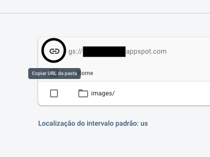

# Projeto Sextou

### As duas versões funcionando:


Este é o codigo aberto do projeto sextou. Apenas as pastas lib do app de cadastro e do app publico estão disponiveis neste repositorio, o resto do conteudo dos apps foi ocultado por conter informações sensiveis (como configurações do firebase, google play e app store)

## Tecnologias utilizadas

- [Flutter](https://flutter.io)
- [Firebase](https://firebase.google.com/)

## Como clonar os apps

1. ### Firebase:

Crie um novo app flutter para cada um dos projetos (app publico do sextou e app de cadastro). Apague todo o conteudo da pasta lib desses projetos e substitua pelo conteudo das pastas lib contidas neste repositorio (cada uma em seu respectivo app).

E nescessario configurar o configurar o Firebase Firestore como backend dos 2 apps, a configuração pode mudar com o tempo

- [Como configurar o Firebase Firestore como backend do seu app Flutter](https://www.youtube.com/watch?v=DqJ_KjFzL9I) - (funcionando em 2019)
- [Documentação oficial do Firebase](https://firebase.google.com/docs)

Com o firestore configurado, acesse painel do seu projeto no **firebase console**. Na aba *'Storage'*, crie uma nova pasta com o nome *'images'* (é importante que o nome seja extamente esse).



Clique no icone para copiar a referencia para o seu storage bucket.

```dart
final storage = FirebaseStorage(storageBucket: "SEU_LINK_PARA_O_STORAGE_BUCKET").ref();
```

No app de cadastro abra o arquivo 'lib/models/firebase_connection.dart' e subistitua pela string 'SEU_LINK_PARA_O_STORAGE_BUCKET' na linha 13 pela referencia copiada do firebase console.

2. ### Dependencias:

Adicione as seguintes dependencias no arquivo **pubspec.yaml** de seus respectivos apps

- Sextou: 
  
  ```yaml
  dependencies:

    flutter:
      sdk: flutter

    cloud_firestore: ^0.12.9+3

    firebase_storage: ^3.0.6

    recase: ^2.0.1

    cached_network_image: ^1.1.1
    
    cupertino_icons: ^0.1.2
  ```

- Sextou Cadastro: 
  
  ```yaml
  dependencies:

    flutter:
      sdk: flutter

    flutter_localizations:
      sdk: flutter

    cloud_firestore: ^0.12.9+1

    firebase_storage: ^3.0.6

    image_picker: ^0.6.1+3

    cached_network_image: ^1.1.1

    cupertino_icons: ^0.1.2
  ```